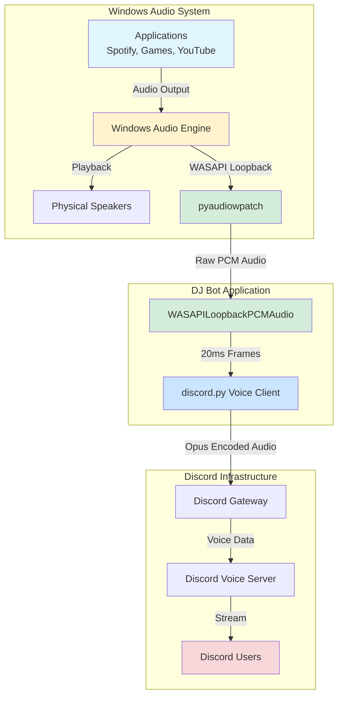
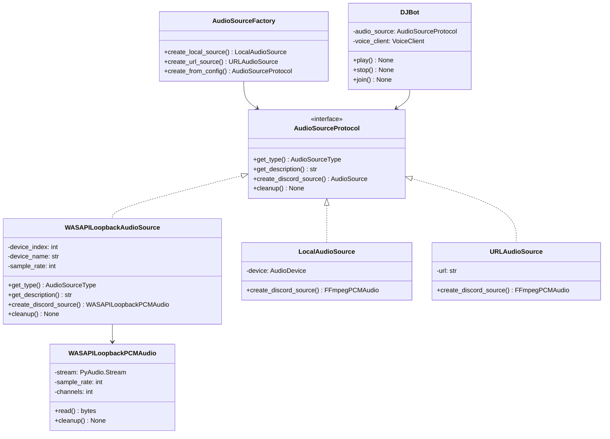

# Amdusias Discord DJ Bot

A Discord bot that streams system audio to voice channels using Windows WASAPI loopback capture. Stream music, games, or any audio playing on your computer directly to Discord without virtual cables or complex setup.

## Features

- 🎵 **System Audio Streaming** - Capture and stream any audio playing on your Windows PC
- 🔊 **WASAPI Loopback** - Direct system audio capture using Windows' built-in API (no virtual cables required)
- 🎛️ **Multi-Device Support** - Select from any audio output device on your system
- 🤖 **Simple Commands** - Easy-to-use Discord commands for controlling playback
- 🏗️ **Extensible Architecture** - Clean, protocol-based design for adding new audio sources
- 🧪 **Fully Tested** - Comprehensive test coverage with pytest

## Architecture

### System Overview



### Component Architecture



### Audio Flow

1. **Application Audio** → Windows applications output audio
2. **Windows Audio Engine** → Mixes all audio streams
3. **WASAPI Loopback** → Captures the mixed output stream before it reaches speakers
4. **pyaudiowpatch** → Python library reads from WASAPI loopback API
5. **WASAPILoopbackPCMAudio** → Reads raw PCM audio in 20ms chunks
6. **Resampling** → Converts to Discord's format (48kHz, stereo, 16-bit PCM)
7. **discord.py** → Encodes to Opus and sends to Discord
8. **Discord Voice Server** → Distributes to all listeners

## Installation

This guide is written for beginners - no coding experience needed! Just follow the steps carefully.

### Step 1: Check Your System

**You Need:**
- ✅ Windows 10 or 11 (this bot only works on Windows)
- ✅ About 500 MB of free disk space
- ✅ A Discord account

### Step 2: Install Python

**If you already have Python installed, skip to Step 3.**

1. Go to [python.org/downloads](https://www.python.org/downloads/)
2. Click the big yellow button that says "Download Python 3.13.x"
3. Run the downloaded file (`python-3.13.x-amd64.exe`)
4. **IMPORTANT:** Check the box "Add Python to PATH" at the bottom!
5. Click "Install Now"
6. Wait for installation to complete (2-3 minutes)

**Verify Python installed:**
1. Press `Windows Key + R`
2. Type `cmd` and press Enter (this opens the Command Prompt)
3. Type `python --version` and press Enter
4. You should see something like `Python 3.13.5`

### Step 3: Install FFmpeg (Audio Processor)

FFmpeg is software that processes audio. Here's how to install it:

1. Download FFmpeg:
   - Go to [github.com/BtbN/FFmpeg-Builds/releases](https://github.com/BtbN/FFmpeg-Builds/releases)
   - Download `ffmpeg-master-latest-win64-gpl.zip`

2. Extract the ZIP file:
   - Right-click the downloaded file
   - Click "Extract All"
   - Extract to `C:\ffmpeg`

3. Add FFmpeg to PATH:
   - Press `Windows Key`, type "environment variables"
   - Click "Edit the system environment variables"
   - Click "Environment Variables" button
   - Under "System variables", find and click "Path"
   - Click "Edit"
   - Click "New"
   - Add: `C:\ffmpeg\bin`
   - Click OK on all windows

4. **Verify FFmpeg installed:**
   - Open a NEW Command Prompt (important - close old ones!)
   - Type `ffmpeg -version` and press Enter
   - You should see FFmpeg version information

### Step 4: Create a Discord Bot

1. Go to [discord.com/developers/applications](https://discord.com/developers/applications)
2. Click "New Application" (top right)
3. Name it (e.g., "DJ Bot") and click "Create"
4. On the left sidebar, click "Bot"
5. Under "Token", click "Reset Token", then "Copy"
6. **Save this token somewhere safe** - you'll need it in Step 7!
7. Scroll down to "Privileged Gateway Intents"
8. Enable: "Server Members Intent" and "Message Content Intent"
9. Click "Save Changes"
10. On the left sidebar, click "OAuth2" > "URL Generator"
11. Check these boxes:
    - Scopes: `bot`
    - Bot Permissions: `Connect`, `Speak`, `Use Voice Activity`
12. Copy the URL at the bottom
13. Paste it in your browser and add the bot to your Discord server

### Step 5: Get Your Server ID

1. Open Discord
2. Go to User Settings (gear icon bottom left)
3. Go to "Advanced" and enable "Developer Mode"
4. Right-click your server name in the server list
5. Click "Copy Server ID"
6. **Save this ID somewhere** - you'll need it in Step 7!

### Step 6: Download This Bot

1. Download this project:
   - Click the green "Code" button on this GitHub page
   - Click "Download ZIP"
   - Extract the ZIP to a folder (e.g., `C:\DJ-Bot`)

2. Open Command Prompt in the folder:
   - Open the folder in File Explorer
   - Click in the address bar (where it shows the folder path)
   - Type `cmd` and press Enter

### Step 7: Install Bot Dependencies

**In the Command Prompt window:**

1. Create a virtual environment (this keeps the bot's files separate):
```bash
python -m venv venv
```
Wait for it to finish (30 seconds).

2. Activate the virtual environment:
```bash
venv\Scripts\activate
```
You should see `(venv)` appear at the start of the line.

3. Install the bot's requirements:
```bash
pip install -r requirements.txt
```
This will download about 100 MB of files (2-5 minutes).

### Step 8: Configure the Bot

1. In the bot folder, find the file `.env.example`
2. Make a copy of it and rename the copy to `.env` (just `.env`, no `.example`)
3. Open `.env` with Notepad
4. Replace the values:
   ```env
   DISCORD_BOT_TOKEN=paste_your_token_here
   DISCORD_GUILD_ID=paste_your_server_id_here
   COMMAND_PREFIX=!
   AUDIO_BITRATE=128
   AUDIO_SAMPLE_RATE=48000
   ```
5. Paste your bot token and server ID from Steps 4 and 5
6. Save and close the file

**Your `.env` should look like:**
```env
DISCORD_BOT_TOKEN=MTIzNDU2Nzg5MDEyMzQ1Njc4OQ.AbCdEf.GhIjKlMnOpQrStUvWxYz123456
DISCORD_GUILD_ID=123456789012345678
COMMAND_PREFIX=!
AUDIO_BITRATE=128
AUDIO_SAMPLE_RATE=48000
```

## Usage

### Step 9: Start the Bot!

1. **Make sure your virtual environment is active** - you should see `(venv)` in the Command Prompt
   - If not, run: `venv\Scripts\activate`

2. **Start the bot:**
```bash
python main.py
```

3. **You'll see a menu like this:**
```
============================================================
  Amdusias Discord DJ Bot - Audio Source Selection
============================================================

Local Audio Devices:
  1. Speakers (Realtek Audio) [System Audio Output]
  2. NVIDIA HDMI Output [System Audio Output]
  3. Headphones (USB Audio) [System Audio Output]
  4. Custom URL Stream

============================================================
Select audio source (enter number):
```

4. **Type the number of the device you want to stream FROM**
   - This is usually your main speakers or headphones
   - Type `1` and press Enter (for example)

5. **The bot will start!** You should see:
```
✓ Selected: Speakers (Realtek Audio) [System Audio Output]
============================================================
Bot is ready! Logged in as: DJ Bot#1234
Connected to 1 server(s)
```

### Step 10: Use the Bot in Discord

**Join a voice channel first**, then use these commands:

1. **Start Streaming:**
   - Type: `!play`
   - The bot joins your voice channel and starts streaming

2. **Stop Streaming:**
   - Type: `!stop`
   - The bot stops and leaves

3. **Manually Join:**
   - Type: `!join`
   - Bot joins without playing (useful for testing)

### Commands Reference

| Command | What It Does |
|---------|-------------|
| `!play` | Bot joins your voice channel and starts streaming audio |
| `!stop` | Bot stops streaming and leaves the voice channel |
| `!join` | Bot joins your voice channel (but doesn't play yet) |

### 🔊 IMPORTANT: Avoiding Feedback Loops

**Problem:** If you select your main speakers, you'll hear an infinite echo!

**Solution:** Use Windows' per-app audio routing:

1. Play something (Spotify, YouTube, etc.)
2. Right-click the speaker icon in your taskbar
3. Click "Open Sound settings"
4. Scroll down and click "App volume and device preferences"
5. **Set audio outputs like this:**
   - **Music App (Spotify/VLC/etc.)** → Select one output (e.g., "NVIDIA HDMI")
   - **Discord** → Select a DIFFERENT output (e.g., "Speakers (Realtek)")
6. **When starting the bot, select the device your music apps use** (e.g., NVIDIA HDMI)

**This way:**
- ✅ Your music plays through NVIDIA output
- ✅ Bot captures from NVIDIA output
- ✅ You hear Discord through Realtek speakers
- ✅ No feedback loop!

### Common Questions

**Q: Can I stream from Spotify?**
A: Yes! Just play Spotify, route it to a specific output device, and the bot will capture it.

**Q: Will others hear me talking?**
A: No, the bot only captures system audio (music, games, etc.), not your microphone.

**Q: Can I use this with VRChat or games?**
A: Yes! Route your game audio to the device the bot captures from.

**Q: The bot isn't capturing any audio?**
A: Make sure you selected an output device (not a microphone) and that something is actually playing audio on that device.

**Q: How do I stop the bot?**
A: Type `!stop` in Discord, or press `Ctrl+C` in the Command Prompt.

**Q: How do I run the bot again later?**
A: Open Command Prompt in the bot folder, run `venv\Scripts\activate`, then `python main.py`.

## Project Structure

```
Amdusias-Discord-DJ-Bot/
├── src/
│   ├── audio_device.py           # Audio device enumeration (WASAPI + DirectShow)
│   ├── audio_sources.py          # Audio source implementations
│   ├── audio_source_factory.py   # Factory for creating audio sources
│   ├── bot.py                    # Discord bot implementation
│   └── config.py                 # Configuration management
├── tests/
│   ├── test_audio_device.py
│   ├── test_audio_sources.py
│   ├── test_audio_source_factory.py
│   ├── test_bot.py
│   └── test_config.py
├── main.py                       # Application entry point
├── requirements.txt              # Python dependencies
├── .env.example                  # Environment variable template
└── README.md                     # This file
```

## Technical Details

### Audio Capture Method

The bot uses **WASAPI (Windows Audio Session API) loopback mode** to capture system audio:

- **No Virtual Cables**: Direct API access, no third-party drivers
- **Low Latency**: ~20ms audio frames
- **High Quality**: 48kHz, 16-bit, stereo PCM
- **Universal**: Works with any Windows audio device

### Why WASAPI Loopback?

| Method | Pros | Cons |
|--------|------|------|
| **WASAPI Loopback** ✅ | No drivers, low latency, high quality | Windows-only |
| Stereo Mix | Built-in | Often disabled, poor quality |
| Virtual Cable | Universal | Requires driver install, complex setup |
| Screen Capture | Cross-platform | High latency, CPU intensive |

### Audio Pipeline

```
Applications → Windows Audio Engine → WASAPI Loopback
    ↓
pyaudiowpatch (Python wrapper)
    ↓
WASAPILoopbackPCMAudio.read() [20ms chunks]
    ↓
Resample to 48kHz stereo (if needed)
    ↓
discord.py VoiceClient
    ↓
Opus Encoding
    ↓
Discord Voice Server
    ↓
Listeners
```

## Development

### Running Tests

```bash
# Run all tests
pytest

# Run with coverage
pytest --cov=src

# Run specific test file
pytest tests/test_audio_sources.py
```

### Code Quality

```bash
# Format code
black src tests

# Check formatting
black --check src tests

# Lint
flake8 src tests

# Type check
mypy src
```

### Adding a New Audio Source

1. **Implement the protocol:**
```python
class MyAudioSource:
    def get_type(self) -> AudioSourceType:
        return AudioSourceType.MY_TYPE

    def get_description(self) -> str:
        return "My Custom Source"

    def create_discord_source(self) -> discord.AudioSource:
        # Return a discord.AudioSource implementation
        pass

    def cleanup(self) -> None:
        # Clean up resources
        pass
```

2. **Add to factory:**
```python
# In audio_source_factory.py
def create_my_source(...) -> MyAudioSource:
    return MyAudioSource(...)
```

3. **Add to menu** (optional):
```python
# In main.py
menu_options.append(("my_type", my_data))
```

## Troubleshooting

### No Audio Devices Found

**Problem:** Bot shows no audio devices

**Solution:**
- Ensure FFmpeg is installed: `ffmpeg -version`
- Check Windows audio devices are enabled
- Run as administrator if needed

### Audio Stuttering

**Problem:** Audio cuts out or stutters

**Solution:**
- Increase buffer size in `WASAPILoopbackPCMAudio`
- Check network latency to Discord
- Reduce bitrate in `.env` (try 96 or 64)

### Feedback Loop

**Problem:** Infinite audio feedback

**Solution:**
- Use per-app audio routing (see "Avoiding Feedback" section)
- Don't capture from the same device Discord outputs to

### Bot Disconnects Randomly

**Problem:** Bot leaves voice channel unexpectedly

**Solution:**
- Check Discord bot permissions (Voice: Connect, Speak)
- Ensure stable internet connection
- Check `bot.log` for error messages

## Performance

### Bandwidth Usage

- **128 kbps** (default): ~960 KB/min per listener
- **96 kbps**: ~720 KB/min per listener
- **64 kbps**: ~480 KB/min per listener

Calculate max listeners: `(Uplink Mbps × 1000) / (Bitrate × 1.1)`

Example: 10 Mbps uplink → ~87 listeners at 128 kbps

### CPU Usage

- **Audio Capture**: <1% CPU (WASAPI is very efficient)
- **Encoding**: ~2-5% CPU per stream (discord.py handles this)
- **Total**: Minimal impact on modern systems

### Latency

- **Capture**: ~20ms (one audio frame)
- **Network**: 50-150ms (depends on location to Discord servers)
- **Total**: ~100-200ms end-to-end latency

## Contributing

Contributions are welcome! Please:

1. Fork the repository
2. Create a feature branch
3. Follow the coding standards in `CLAUDE.md`
4. Add tests for new features
5. Submit a pull request

See `CONTRIBUTING.md` for detailed guidelines.

## License

This project is licensed under the MIT License - see the `LICENSE` file for details.

## Acknowledgments

- **[pyaudiowpatch](https://github.com/s0d3s/PyAudioWPatch)** - WASAPI loopback Python wrapper
- **[discord.py](https://github.com/Rapptz/discord.py)** - Discord API wrapper
- **[FFmpeg](https://ffmpeg.org/)** - Audio processing

## Support

- 🐛 **Bug Reports**: [GitHub Issues](https://github.com/yourusername/Amdusias-Discord-DJ-Bot/issues)
- 💬 **Discussions**: [GitHub Discussions](https://github.com/yourusername/Amdusias-Discord-DJ-Bot/discussions)

---

**Made with ❤️ for the Discord audio streaming community**
